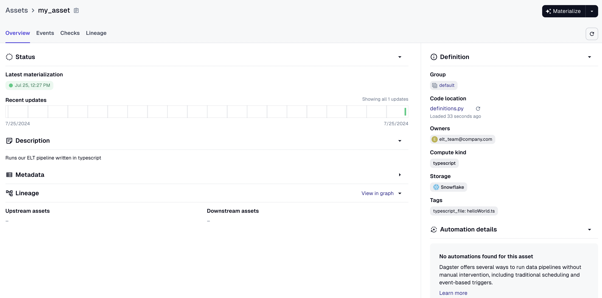
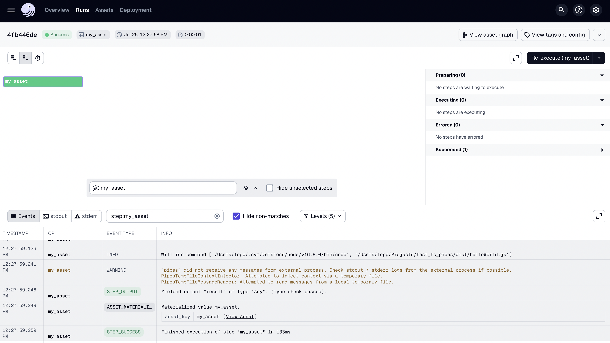
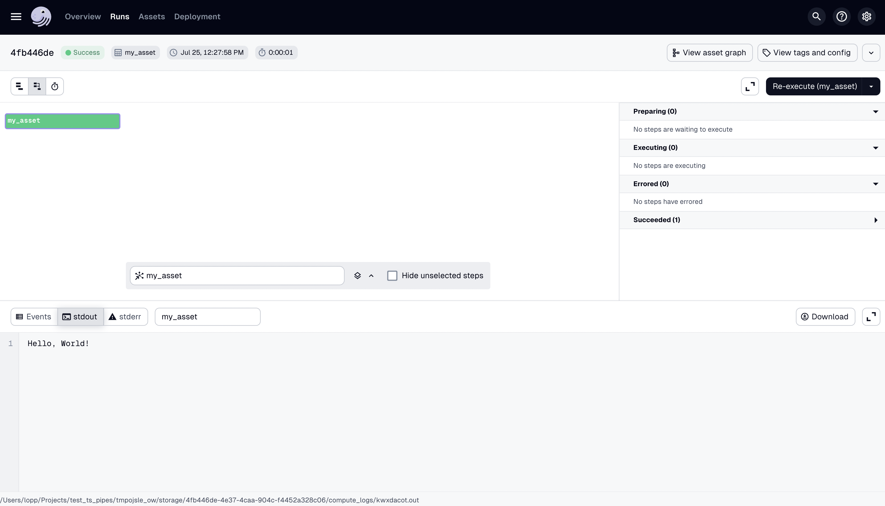

# Dagster & Typescript

This example shows how to use Dagster pipes to invoke Typescript files. The Dockerfile shows an example of how those files could be built and packaged alongside Dagster code.

The result is:

1. An asset that includes metadata:

2. Runs will invoke node in a sub-process, but can include any additional metadata logged from the Dagster process (in this case the sub-command):

3. The stdout for the asset will contain any information logged from the typescript sub-process.

Other pipes clients could be used, eg the Kubernetes pipes client could be used to invoke a Docker image that contains the typescript code. 

Future work will include a Typescript Dagster pipes package so that runtime metadata can be easily sent back from the TS code to Dagster.